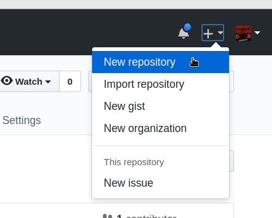
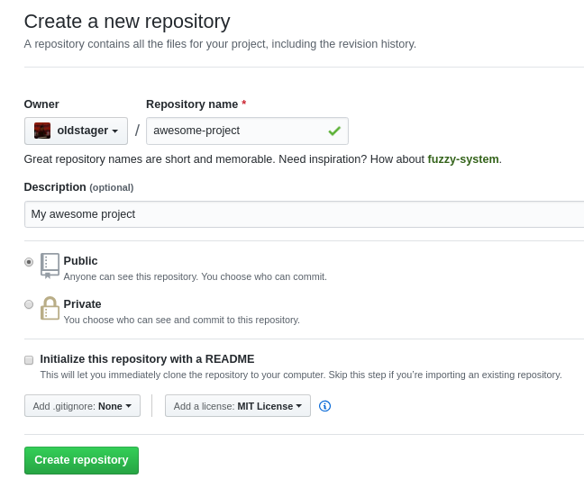
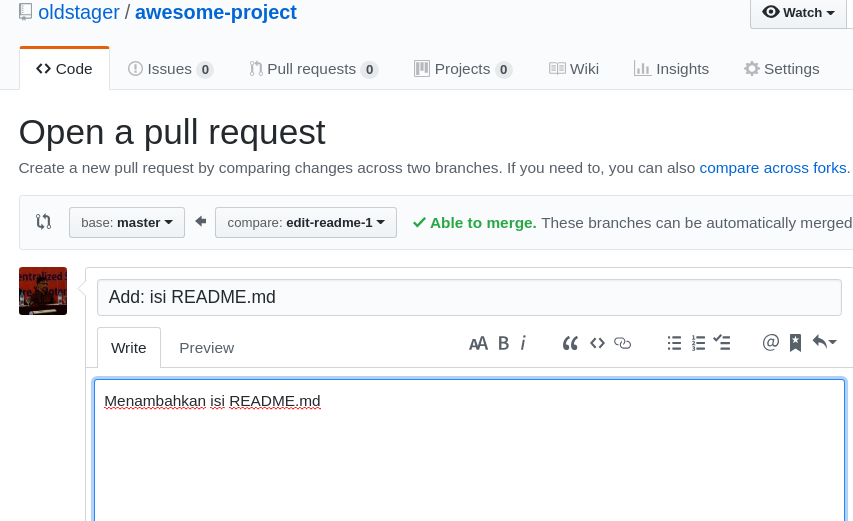
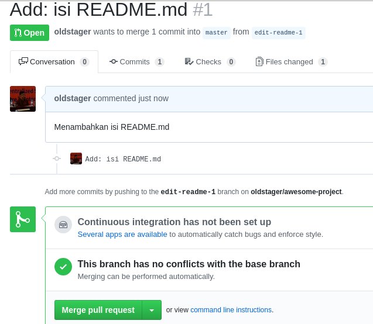

# Mengelola Repo Sendiri di Account Sendiri

[ [<< Kembali](README.md) ]

Bagian ini merupakan seri tulisan tentang [Git](https://git-scm.com/). Silahkan ke [README.md](README.md) untuk memahami gambaran garis besar materi-materi yang dituliskan.

## Langkah-langkah

Setiap orang yang telah mempunyai account di GitHub bisa membuat repo dengan. Secara umum, langkah-langkahnya adalah sebagai berikut:

1. Buat repo kosong di GitHub, bisa *public* maupun *private*.
2. Cloe repo kosong tersebut di komputer lokal
3. Perintah berikutnya terkait dengan perubahan repo serta sinkronisasi antara GitHub dengan lokal.

## Membuat Repo

Untuk membuat repo, gunakan langkah-langkan berikut:

1.  Klik tanda **+** pada bagian atas setelah login, pilih **New repository**



2.  Isikan nama, keterangan, serta lisensi. Jika dikehendaki, bisa membuat repo **Private**



3. Klik ```Create Repository```

Setelah langkah-langkah tersebut, repo akan dibuat dan bisa diakses menggunakan pola ```https://github.com/username/reponame```. Pada repo tersebut, hanya akan muncul 1 file, yaitu LICENSE. Jika memilih membuat README pada saat langkah ke 2, juga akan muncul README.md. Ada atau tidak ada README.md tidak mempunyai efek apapun pada langkah ini.

## Clone Repo

Proses ```clone``` adalah proses untuk menduplikasikan remote repo di GitHub ke komputer lokal. Untuk melakukan proses ```clone```, gunakan perintah berikut:

```bash
git clone https://github.com/oldstager/awesome-project
Cloning into 'awesome-project'...
remote: Enumerating objects: 3, done.
remote: Counting objects: 100% (3/3), done.
remote: Compressing objects: 100% (2/2), done.
remote: Total 3 (delta 0), reused 0 (delta 0), pack-reused 0
Unpacking objects: 100% (3/3), done.
```

Setelah perintah ini, di direktori ```awesome-project``` akan disimpan isi repo yang sama dengan di GitHub. Perbedaannya, di komputer lokal terdapat direktori ```.git``` yang digunakan secara internal oleh Git.

## Mengelola Repo

Setelah ```clone``` ke komputer lokal, semua manipulasi konten dilakukan di komputer lokal dan hasilnya akan di-*push* ke remote repo di GitHub. Dengan demikian, jangan berganti-ganti remote lokal, sekali dibuat disitu, tetap berada disitu. Jika kehilangan repo lokal, clone ulang ke direktori yang bersih (kosong) setelah itu baru lakukan pengelolaan repo. Beberapa hal yang biasanya dilakukan akan diuraikan berikut ini.

### Mengubah Isi - Push Tanpa Branching dan Merging

Perubahan isi bisa terjadi karena satu atau kombinasi beberapa hal berikut:
1. File dihapus
2. File diedit
3. Membuat file / direktori baru
4. Menghapus direktori

Untuk kasus-kasus tersebut, lakukan perubahan di komputer lokal, setelah itu push ke repo. 

```bash
$ vim README.md
$ cat README.md
# My Awesome Project

$ git status
On branch master
Your branch is up to date with 'origin/master'.

Untracked files:
  (use "git add <file>..." to include in what will be committed)

	README.md

nothing added to commit but untracked files present (use "git add" to track)
$ git add -A
$ git commit -m "Add: README.md"
[master 2ab2e28] Add: README.md
 1 file changed, 2 insertions(+)
 create mode 100644 README.md
$ git push origin master
Username for 'https://github.com': oldstager
Password for 'https://oldstager@github.com': 
Enumerating objects: 4, done.
Counting objects: 100% (4/4), done.
Delta compression using up to 8 threads
Compressing objects: 100% (2/2), done.
Writing objects: 100% (3/3), 324 bytes | 324.00 KiB/s, done.
Total 3 (delta 0), reused 0 (delta 0)
To https://github.com/oldstager/awesome-project
   8dd68d4..2ab2e28  master -> master
$
```

Cara ini lebih mudah tetapi mempunyai resiko jika terjadi kesalahan dalam edit. Cara yang lebih aman tetapi memerlukan langkah yang lebih panjang adalah ```branching and merging```

### Mengubah Isi dengan Branching and Merging

Dengan menggunakan cara ini, setiap kali akan melakukan perubaham, perubahan itu dilakukan di komputer lokal dengan membuat suatu *cabang* yang nantinya digunakan untuk menampung perubahan-perubahan tersebut. Setelah itu, cabang itu yang akan dikirim ke repo GitHub untuk dimintai review kemudian digabungkan (```merge```) ke master. Secara umum, repo yang dibuat biasanya sudah mempunyai satu branch yang disebut dengan ```master```. Cara ini lebih aman, terstruktur, terkendali, dan mempunyai
history yang lebih baik. Jika perubahan yang kita buat sudah terlalu kacau dan kita menyesal, maka ada cara untuk "membersihkan" repo lokal kita. Secara umum, langkahnya adalah sebagai berikut:

1. Buat branch untuk menampung perubahan-perubahan
2. Lakukan perubahan-perubahan
3. Add dan commit perubahan-perubahan tersebut ke branch
4. Kembali ke repo master
5. Buat pull request di GitHub
6. Merge pull request di GitHub
7. Merge branch untuk menampung perubahan-perubahan tersebut ke master.
8. Selesai.

```bash
$ git checkout -b edit-readme-1
Switched to a new branch 'edit-readme-1'
$ vim README.md
$ cat README.md
# My Awesome Project

Ini isi proyek
$ git status
On branch edit-readme-1
Changes not staged for commit:
  (use "git add <file>..." to update what will be committed)
  (use "git checkout -- <file>..." to discard changes in working directory)

	modified:   README.md

no changes added to commit (use "git add" and/or "git commit -a")
$ git add -A
$ git commit -m "Add: isi README.md"
[edit-readme-1 032d079] Add: isi README.md
 1 file changed, 1 insertion(+)
$ git checkout master
Switched to branch 'master'
Your branch is up to date with 'origin/master'.
$ git status
On branch master
Your branch is up to date with 'origin/master'.

nothing to commit, working tree clean
$ git push origin edit-readme-1
Username for 'https://github.com': oldstager
Password for 'https://oldstager@github.com':
Enumerating objects: 5, done.
Counting objects: 100% (5/5), done.
Delta compression using up to 8 threads
Compressing objects: 100% (2/2), done.
Writing objects: 100% (3/3), 338 bytes | 338.00 KiB/s, done.
Total 3 (delta 0), reused 0 (delta 0)
remote:
remote: Create a pull request for 'edit-readme-1' on GitHub by visiting:
remote:      https://github.com/oldstager/awesome-project/pull/new/edit-readme-1
remote:
To https://github.com/oldstager/awesome-project
 * [new branch]      edit-readme-1 -> edit-readme-1
$

```

Setelah itu, kirim *pull request (PR)*:



Setelah membuat PR, PR tersebut bisa di-merge:



Setelah itu, ```Confirm Merge```, branch yang kita kirimkan tadi sudah dimasukkan ke branch ```master```. Setelah itu, merge di komputer lokal:

```bash
$ git merge edit-readme-1
Updating 2ab2e28..032d079
Fast-forward
 README.md | 1 +
 1 file changed, 1 insertion(+)
$ git branch -D edit-readme-1
Deleted branch edit-readme-1 (was 032d079).
$ git branch
* master
$ git pull
remote: Enumerating objects: 1, done.
remote: Counting objects: 100% (1/1), done.
remote: Total 1 (delta 0), reused 0 (delta 0), pack-reused 0
Unpacking objects: 100% (1/1), done.
From https://github.com/oldstager/awesome-project
   2ab2e28..7e546b0  master     -> origin/master
Updating 032d079..7e546b0
Fast-forward
$
```

### Sinkronisasi

Suatu saat, bisa saja terjadi kita menggunakan komputer lain dan mengedit repo melalui repo lokal di komputer lain, setelah itu pindah ke kamputer lain lagi. Saat itu, kita perlu melakukan sinkronisasi ke kemputer lokal. Perintah untuk sinkronisasi adalah:

```
$ git pull
```

Perintah ini dikerjakan di direktori tempat repo lokal kita berada.

### Membatalkan Perubahan

Praktik yang baik adalah membuat *branch* pada saat kita akan melakukan perubahan-perubahan. Jika perubahan-perubahan yang kita lakukan sudah sedemikian kacaunya, maka kita bisa membuat supaya perubahan-perubahan yang kacau tersebut hilang dan kembali ke kondisi bersih seperti semula.

```bash
$ git checkout -b edit-readme-2
Switched to a new branch 'edit-readme-2'
$ vim README.md
$ cat README.md
# My Awesome Project

Ini isi proyek. Jadi agak kacau nih
$ git checkout master
M	README.md
Switched to branch 'master'
Your branch is up to date with 'origin/master'.
$ cat README.md
# My Awesome Project

Ini isi proyek. Jadi agak kacau nih
$ git branch -D edit-readme-2
Deleted branch edit-readme-2 (was 7e546b0).
$ git branch
* master
$ cat README.md
# My Awesome Project

Ini isi proyek. Jadi agak kacau nih
$ git reset --hard
HEAD is now at 7e546b0 Merge pull request #1 from oldstager/edit-readme-1
$ cat README.md
# My Awesome Project

Ini isi proyek
$
```

### Undo Commit Terakhir

Suatu saat, mungkin kita sudah terlanjur mem-*push* perubahan ke repo GitHub, setelah itu kita baru menyadari bahwa perubahan tersebut salah. Untuk itu, kita bisa melakukan ```git revert```.

```
$ cat README.md
# My Awesome Project

Ini isi proyek
$ git log --oneline
7e546b0 (HEAD -> master, origin/master, origin/HEAD) Merge pull request #1 from oldstager/edit-readme-1
032d079 (origin/edit-readme-1) Add: isi README.md
2ab2e28 Add: README.md
8dd68d4 Initial commit
$ vim README.md
$ git add -A
$ git commit -m "Add: contents"
[master c55fd06] Add: contents
 1 file changed, 4 insertions(+), 1 deletion(-)
$ git push origin master 
Username for 'https://github.com': oldstager
Password for 'https://oldstager@github.com': 
Enumerating objects: 5, done.
Counting objects: 100% (5/5), done.
Delta compression using up to 8 threads
Compressing objects: 100% (3/3), done.
Writing objects: 100% (3/3), 335 bytes | 335.00 KiB/s, done.
Total 3 (delta 0), reused 0 (delta 0)
To https://github.com/oldstager/awesome-project
   7e546b0..c55fd06  master -> master
$ vim README.md
$  git add -A
$  git commit -m "Add: contents - 2"
[master fed7e79] Add: contents - 2
 1 file changed, 1 insertion(+)
$ git push origin master
Username for 'https://github.com': oldstager
Password for 'https://oldstager@github.com': 
Enumerating objects: 5, done.
Counting objects: 100% (5/5), done.
Delta compression using up to 8 threads
Compressing objects: 100% (3/3), done.
Writing objects: 100% (3/3), 338 bytes | 338.00 KiB/s, done.
Total 3 (delta 0), reused 0 (delta 0)
To https://github.com/oldstager/awesome-project
   c55fd06..fed7e79  master -> master
$ cat README.md
# My Awesome Project

Ini isi proyeka

Ini isi 1

Ini isi 2
$ git status
On branch master
Your branch is up to date with 'origin/master'.

nothing to commit, working tree clean
$
```

Contoh di atas adalah contoh untuk mengubah README.md dengan beberapa commit. Setelh itu, kita akan mengembalikan ke posisi terakhir sebelum commit terakhir.

```bash
$ git revert HEAD
```

Perintah di atas akan membuka editor. Pada editor tersebut kita bisa mengetikkan pesan *revert* ( = pesan commit untuk pembatalan). Setelah selesai, simpan:

```bash
[master f800ced] Revert "Add: contents - 2"
 1 file changed, 1 deletion(-)
$
```

Selanjutnya, tinggal di-*push* ke repo GitHub.

```

$ git status
On branch master
Your branch is ahead of 'origin/master' by 1 commit.
  (use "git push" to publish your local commits)

nothing to commit, working tree clean
$ git push origin master
Username for 'https://github.com': oldstager
Password for 'https://oldstager@github.com': 
Enumerating objects: 5, done.
Counting objects: 100% (5/5), done.
Delta compression using up to 8 threads
Compressing objects: 100% (3/3), done.
Writing objects: 100% (3/3), 347 bytes | 347.00 KiB/s, done.
Total 3 (delta 1), reused 0 (delta 0)
remote: Resolving deltas: 100% (1/1), completed with 1 local object.
To https://github.com/oldstager/awesome-project
   fed7e79..f800ced  master -> master
$ cat README.md
# My Awesome Project

Ini isi proyeka

Ini isi 1

$
```

Jika commit sudah dilakukan, tetapi belum di-*push* ke repo GitHub (masih berada di lokal), cara membatalkannya:

```
$ vim README.md
$ cat README.md
# My Awesome Project

Ini isi proyeka

Ini isi 1

Ini isi tambahan 1

$ git add -A
$ git commit -m "Add: isi tambahan 1"
[master 42e6bf0] Add: isi tambahan 1
 1 file changed, 2 insertions(+)
$ git status
On branch master
Your branch is ahead of 'origin/master' by 1 commit.
  (use "git push" to publish your local commits)

nothing to commit, working tree clean
$ git log --oneline
42e6bf0 (HEAD -> master) Add: isi tambahan 1
f800ced (origin/master, origin/HEAD) Revert "Add: contents - 2"
fed7e79 Add: contents - 2
c55fd06 Add: contents
7e546b0 Merge pull request #1 from oldstager/edit-readme-1
032d079 (origin/edit-readme-1) Add: isi README.md
2ab2e28 Add: README.md
8dd68d4 Initial commit
$ git reset --hard HEAD^
HEAD is now at f800ced Revert "Add: contents - 2"
$ git status
On branch master
Your branch is up to date with 'origin/master'.

nothing to commit, working tree clean
$ cat README.md
# My Awesome Project

Ini isi proyeka

Ini isi 1

$
```

Untuk kembali ke perubahan pada saat yang sudah lama, yang perlu dilakukan adalah melakukan ```git revert <posisi>``` kemudian mengedit secara manual kemudian push ke repo.

```bash
$ cat README.md
# My Awesome Project

Ini isi proyeka

Ini isi 1

Ini isi 2

Ini isi 3
$ git log --oneline
b14810f (HEAD -> master, origin/master, origin/HEAD) Add: isi 3
a7615fb Add: isi 2
f800ced Revert "Add: contents - 2"
fed7e79 Add: contents - 2
c55fd06 Add: contents
7e546b0 Merge pull request #1 from oldstager/edit-readme-1
032d079 (origin/edit-readme-1) Add: isi README.md
2ab2e28 Add: README.md
8dd68d4 Initial commit
$ git revert a7615fb
error: could not revert a7615fb... Add: isi 2
hint: after resolving the conflicts, mark the corrected paths
hint: with 'git add <paths>' or 'git rm <paths>'
hint: and commit the result with 'git commit'
$
```

Setelah itu, jika dilihat pada file, akan muncul tambahan untuk memudahkan meng-edit. File ini harus di-*resolve* terlebih dahulu, setelah itu baru di add dan commit:

```bash
$ cat README.md
# My Awesome Project

Ini isi proyeka

Ini isi 1

<<<<<<< HEAD
Ini isi 2

Ini isi 3
=======
>>>>>>> parent of a7615fb... Add: isi 2
```

Edit file tersebut, setelah itu simpan.

```bash
$ vim README.md 
$ cat README.md
# My Awesome Project

Ini isi proyek

Ini isi 1

Ini isi 2 setelah revert

Rni isi 3
$ git status
On branch master
Your branch is up to date with 'origin/master'.

You are currently reverting commit a7615fb.
  (fix conflicts and run "git revert --continue")
  (use "git revert --abort" to cancel the revert operation)

Unmerged paths:
  (use "git reset HEAD <file>..." to unstage)
  (use "git add <file>..." to mark resolution)

	both modified:   README.md

no changes added to commit (use "git add" and/or "git commit -a")
$
```

Setelah itu, lanjutkan proses revert. Saat ```git revert --continue``` isikan pesan revert.

```bash
$ git add README.md
$ git status
On branch master
Your branch is up to date with 'origin/master'.

You are currently reverting commit a7615fb.
  (all conflicts fixed: run "git revert --continue")
  (use "git revert --abort" to cancel the revert operation)

Changes to be committed:
  (use "git reset HEAD <file>..." to unstage)

	modified:   README.md

$ git revert --continue
[master dec93e1] Revert "Add: isi 2"
 1 file changed, 3 insertions(+), 3 deletions(-)
$ git status
On branch master
Your branch is ahead of 'origin/master' by 1 commit.
  (use "git push" to publish your local commits)

nothing to commit, working tree clean
$ git push origin master
Username for 'https://github.com': oldstager
Password for 'https://oldstager@github.com': 
Enumerating objects: 5, done.
Counting objects: 100% (5/5), done.
Delta compression using up to 8 threads
Compressing objects: 100% (3/3), done.
Writing objects: 100% (3/3), 401 bytes | 401.00 KiB/s, done.
Total 3 (delta 0), reused 0 (delta 0)
To https://github.com/oldstager/awesome-project
   b14810f..dec93e1  master -> master
$
```


