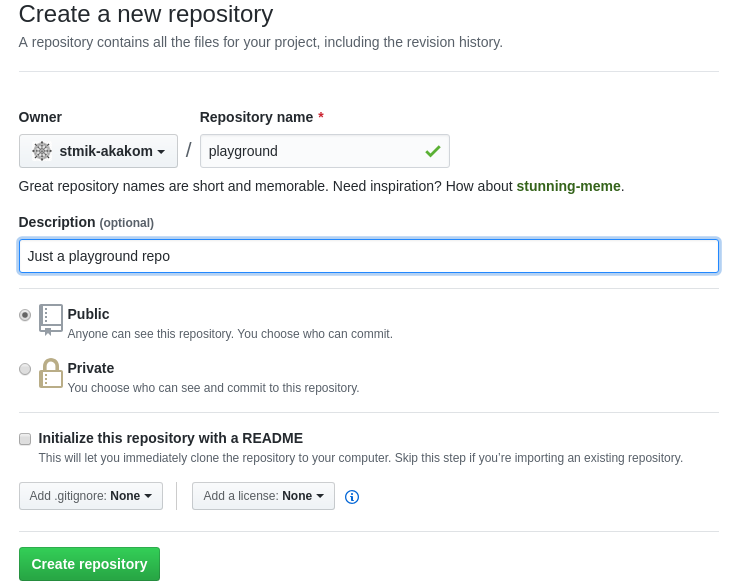

# Mengelola Repo Sendiri di Organisasi

[ [<< Kembali](README.md) ]

Bagian ini merupakan seri tulisan tentang [Git](https://git-scm.com/). Silahkan ke [README.md](README.md) untuk memahami gambaran garis besar materi-materi yang dituliskan.

Repo yang dibuat bisa diletakkan pada account kita maupun berada pada suatu organisasi. Organisasi bisa kita buat sendiri maupun kita dimasukkan menjadi anggota organisasi. Pada dasarnya, bagian ini sama dengan bagian sebelumnya, hanya saja, pada saat membuat repo **Owner** dari repo adalah organisasi seperti berikut ini:

Operasi-operasi lainnya sama saja dengan pembahasan sebelumnya.

