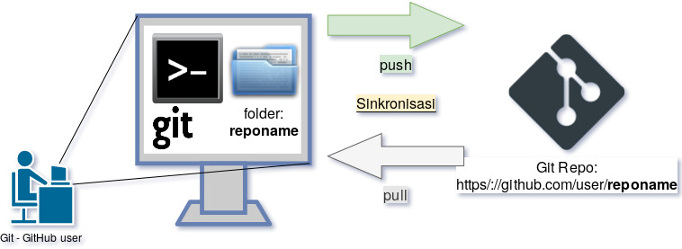

# Mengelola Repo Sendiri

[ [<< Kembali](README.md) ]

Bagian ini merupakan seri tulisan tentang [Git](https://git-scm.com/). Silahkan ke [README.md](README.md) untuk memahami gambaran garis besar materi-materi yang dituliskan.

Sebagai pengguna Git dan GitHub, kita bisa mempunyai *repository* (sering disingkat dengan *repo* saja) di GitHub, baik untuk repo yang bersifat publik maupun bersifat privat. Jika ingin menggunakan repo yang bersifat privat (hanya bisa diakses oleh pemakai GitHub yang dikehendaki), maka kita harus membayar.

Suatu repo dimaksudkan untuk menyimpan aset digital (dokumen, *source code*, gambar, dan lain-lain). Setiap satu repo biasanya digunakan untuk satu kepentingan tertentu. Repo yang ada di GitHub ini juga ada di komputer lokal pengguna. Dengan demikian, untuk setiap repo, kita mempunyai tempat penyimpanan di GitHub maupun di komputer lokal dan keduanya tersinkronisasi. Pemakai biasanya melakukan berbagai manipulasi di komputer lokal, setelah itu mengirimkan hasilnya ke repo GitHub. Proses ini disebut dengan proses **push**. 

Pada dasarnya, repo yang kita buat bisa berada di akun GitHub kita sendiri maupun menyatu dalam repo organisasi.

* [Mengelola repo sendiri di account sendiri](03-mengelola-repo-sendiri-account.md)
* [Mengelola repo sendiri di organisasi](03-mengelola-repo-sendiri-organisasi.md)
