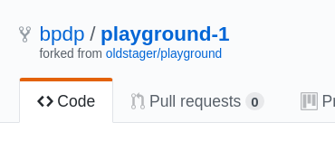

# Git untuk Kolaborasi

[ [<< Kembali](README.md) ]

Bagian ini merupakan seri tulisan tentang [Git](https://git-scm.com/). Silahkan ke [README.md](README.md) untuk memahami gambaran garis besar materi-materi yang dituliskan.

## Pendahuluan

Selain untuk mengelola aset digital milik diri sendiri, kita bisa menggunakan Git untuk berkolaborasi dalam suatu repo di GitHub yang bisa diakses bersama. Dalam kasus seperti ini, berarti ada 2 peran:

1. Pemilik repo, sering disebut sebagai *upstream author*.
2. Kontributor, yaitu orang-orang yang akan berkontribusi memberikan konten.

Untuk situasi seperti ini, diasumsikan:

1. *Upstream author* telah membuat repo git di GitHub
2. Kontributor telah mengetahui adanya repo tersebut, tertarik untuk berkontribusi, sudah mengetahui apa yang akan diberikan ke proyek (repo GitHub *upstream author*) tersebut.
3. Pembahasan selanjutnya adalah tentang bagaimana kontributor bisa mengirimkan kontribusi ke repo GitHub milik *upstream author*.

Dalam pembahasan ini:

1. *Upstream author* adalah *oldstager*.
2. Kontributor adalah *bpdp*
3. Repo dari *upstream author* adalah **playground** yang bisa diakses di [https://github.com/oldstager/playground](https://github.com/oldstager/playground)

## Fork

Fork adalah membuat clone dari suatu repo di GitHub milik *upstream author*, diletakkan ke milik kontributor. Fork hanya dilakukan sekali saja. Pada dasarnya, proses untuk fork ini meliputi:

1. Fork repo di web GitHub.
2. Clone fork tersebut di komputer lokal.

Kontributor harus mem-*fork* repo *upstream author* sehingga di repo kontributor muncul repo tersebut. Proses *forking* ini dijelaskan dengan langkah-langkah berikut:

1. Login ke GitHub
2. Akses repo yang akan di-*fork*: https://github.com/oldstager/playground
3. Pada sisi kanan atas, klik Fork:


4. Pilih akan ditempatkan di account mana.


5. Setelah proses, repo dari *upstream author* sudah berada di account GitHub kita (kontributor)



Setelah proses tersebut, clone di komputer lokal:

```bash
$ git clone https://github.com/bpdp/playground-1
Cloning into 'playground-1'...
remote: Enumerating objects: 3, done.
remote: Counting objects: 100% (3/3), done.
remote: Compressing objects: 100% (2/2), done.
remote: Total 3 (delta 0), reused 3 (delta 0), pack-reused 0
Unpacking objects: 100% (3/3), done.
zaky@dellvuan:~$ ls -la playground-1/
total 16
drwxr-xr-x 3 zaky zaky 4096 Jan 21 11:31 .
drwxr-xr-x 3 zaky zaky 4096 Jan 21 11:31 ..
drwxr-xr-x 8 zaky zaky 4096 Jan 21 11:31 .git
-rw-r--r-- 1 zaky zaky   81 Jan 21 11:31 README.md
$
```

Setelah itu, konfigurasikan repo lokal kontributor. Pada kondisi saat ini, di komputer lokal sudah terdapat repo `playground-1` yang berada pada direktori dengan nama yang sama. Untuk keperluan berkontribusi, ada 2 nama repo yang harus diatur:
  1. **origin**: menunjuk ke repo milik kontributor di GitHub, hasil dari fork.
  2. **upstream**: menunjuk ke repo milik *upstream* author (repo asli) di account *oldstager*.

Repo `origin` sudah dituliskan konfigurasinya pada saat melakukan proses clone dari repo kontributor. Konfigurasi repo *upstream* harus dibuat.

```bash
$ git remote -v
origin	https://github.com/bpdp/playground-1 (fetch)
origin	https://github.com/bpdp/playground-1 (push)
$
```

Tambahkan remote upstream:

```
$ git remote add upstream https://github.com/oldstager/playground.git
```

Hasil:

```
$ git remote -v
origin	https://github.com/bpdp/playground-1 (fetch)
origin	https://github.com/bpdp/playground-1 (push)
upstream	https://github.com/oldstager/playground.git (fetch)
upstream	https://github.com/oldstager/playground.git (push)
$
```

## Mengirimkan Pull Request 

Setiap kali melakukan perubahan, kirim perubahan tersebut. Pengiriman ini disebut dengan *Pull Request*. Pada posisi ini, kontributor bisa mengirimkan kontribusi dengan cara mengirimkan *pull request* (PR) ke *upstream author*. Secara umum, langkah-langkahnya adalah sebagai berikut:

1. Kontributor akan bekerja di repo lokal (create, update, delete isi)
2. Commit
3. Push ke repo kontributor
4. Kirimkan PR ke repo *upstream author*.
5. *Upstream author* me-*review* dan kemudian menyetujui (*merge*) ke master atau menolak PR.
6. Jika disetujui dan di-*merge* ke repo master dari *upstream author*, sinkronkan repo di komputer lokal dan repo GitHub kontributor.

Berikut ini adalah contoh pengiriman perubahan isi README.md dengan menambahkan kontributor.

### Membuat Perubahan di Repo Lokal

Sebelum melakukan perubahan, pastikan:

1. Sudah ada koordinasi secara manual tentang perubahan-perubahan yang akan dilakukan.
2. Setelah melakukan perubahan-perubahan, pastikan bahwa isi repo lokal tersinkronisasi dengan repo dari *upstream author*.
3. Cara melakukan sinkronisasi:

```bash
$ cd playground-1
$ git fetch upstream
From https://github.com/oldstager/playground
 * [new branch]      master     -> upstream/master
$
```

4. Lakukan perubahan-perubahan, setelah itu push ke **origin** (milik kontributor)

```bash
$ cd playground-1
$ ls -la
total 16
drwxr-xr-x 3 zaky zaky 4096 Jan 21 11:31 .
drwxr-xr-x 3 zaky zaky 4096 Jan 21 11:31 ..
drwxr-xr-x 8 zaky zaky 4096 Jan 21 12:05 .git
-rw-r--r-- 1 zaky zaky   81 Jan 21 11:31 README.md
$ cat README.md 
# Playground

It's just an example repo so that people can use it to learn Git.

$ git checkout -b add-contributor
Switched to a new branch 'add-contributor'
$ git branch
* add-contributor
  master
$ vim README.md
$ cat README.md 
# Playground

It's just an example repo so that people can use it to learn Git.

## Contributor

1. [bpdp](https://github.com/bpdp)

$ git status
On branch add-contributor
Changes not staged for commit:
  (use "git add <file>..." to update what will be committed)
  (use "git checkout -- <file>..." to discard changes in working directory)

	modified:   README.md

no changes added to commit (use "git add" and/or "git commit -a")
$ git add -A
$ git commit -m "Add: contributor"
[add-contributor 22d9c0b] Add: contributor
 1 file changed, 4 insertions(+)
$ git checkout master
Switched to branch 'master'
Your branch is up to date with 'origin/master'.
$ git push origin add-contributor 
Username for 'https://github.com': bpdp
Password for 'https://bpdp@github.com': 
Enumerating objects: 5, done.
Counting objects: 100% (5/5), done.
Delta compression using up to 8 threads
Compressing objects: 100% (2/2), done.
Writing objects: 100% (3/3), 373 bytes | 373.00 KiB/s, done.
Total 3 (delta 0), reused 0 (delta 0)
remote: 
remote: Create a pull request for 'add-contributor' on GitHub by visiting:
remote:      https://github.com/bpdp/playground-1/pull/new/add-contributor
remote: 
To https://github.com/bpdp/playground-1
 * [new branch]      add-contributor -> add-contributor
$
```

5. Setelah itu, buka halaman Web dari repo kontributor [https://github.com/bpdp/playground-1](https://github.com/bpdp/playground-1). Pada halaman tersebut akan ditampilkan isi yang kita push. 


6. Pilih ```Compare and pull request```, kemudian isikan deskripsi PR dan klik pada ```Create pull request```:


7. Pada repo *upstream author*, muncul angka 1 (artinya jumlahnya 1) pada ```Pull requests``` di bagian atas.
8. *Upstream author* bisa menyetujui setelah melakukan review: klik pada ```Pull requests```, akan muncul PR dengan message seperti yang ditulis oleh kontributor (*Add: contributor*). Klik pada PR tersebut, review kemudian klik ```Merge pull request``` diikuti dengan ```Confirm merge```. Setelah itu, status akan berubah menjadi ```Merged```.
9. Sinkronkan semua repo (lokal maupun GitHub kontributor)

```bash
$ git checkout master
Switched to branch 'master'
Your branch is up to date with 'origin/master'.
$ git branch
  add-contributor
* master
$ git fetch upstream
remote: Enumerating objects: 1, done.
remote: Counting objects: 100% (1/1), done.
remote: Total 1 (delta 0), reused 0 (delta 0), pack-reused 0
Unpacking objects: 100% (1/1), done.
From https://github.com/oldstager/playground
   765eda2..b7183be  master     -> upstream/master
$ cat README.md 
# Playground

It's just an example repo so that people can use it to learn Git.

$ git merge upstream/master
Updating 765eda2..b7183be
Fast-forward
 README.md | 4 ++++
 1 file changed, 4 insertions(+)
zaky@dellvuan:~/playground-1$ git status
On branch master
Your branch is ahead of 'origin/master' by 2 commits.
  (use "git push" to publish your local commits)

nothing to commit, working tree clean
$ git push origin master
Username for 'https://github.com': bpdp
Password for 'https://bpdp@github.com': 
Enumerating objects: 1, done.
Counting objects: 100% (1/1), done.
Writing objects: 100% (1/1), 661 bytes | 661.00 KiB/s, done.
Total 1 (delta 0), reused 0 (delta 0)
To https://github.com/bpdp/playground-1
   765eda2..b7183be  master -> master
$ cat README.md 
# Playground

It's just an example repo so that people can use it to learn Git.

## Contributor

1. [bpdp](https://github.com/bpdp)

$ git branch -D add-contributor 
Deleted branch add-contributor (was 22d9c0b).
$
```

## Konflik

Ada kemungkinan, jika satu orang mengirimkan PR untuk satu atau lebih file dan sementara itu ada lainnya juga yang mengirimkan PR pada satu atau lebih file yang sama, maka akan terjadi konflik karena ada satu atau lebih file yang **sama** yang di-edit dan akan di-*merge*. Jika sampai terjadi kasus seperti ini, maka *upatream author* **harus** menolak semua PR dan kemudian masing-masing kontributor diharapkan menyelesaikan secara manual (offline) kemudian memutuskan siapa yang akan mengirimkan PR.

